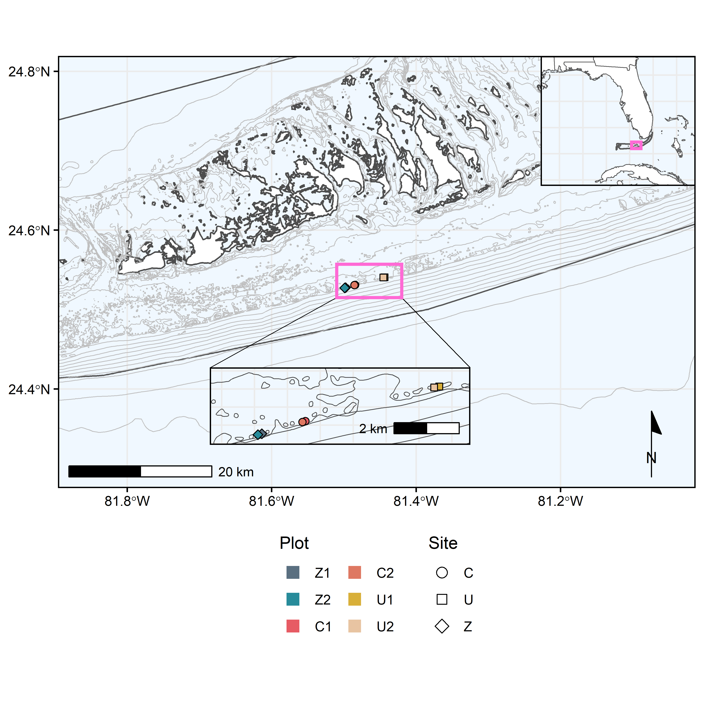

<a href="https://github.com/RyanEckert/FKNMS" class="github-corner" aria-label="View source on GitHub"><svg width="80" height="80" viewBox="0 0 250 250" style="fill:#2C3E50; color:#fff; position: absolute; top: 0; border: 0; right: 0;" aria-hidden="true"><path d="M0,0 L115,115 L130,115 L142,142 L250,250 L250,0 Z"></path><path d="M128.3,109.0 C113.8,99.7 119.0,89.6 119.0,89.6 C122.0,82.7 120.5,78.6 120.5,78.6 C119.2,72.0 123.4,76.3 123.4,76.3 C127.3,80.9 125.5,87.3 125.5,87.3 C122.9,97.6 130.6,101.9 134.4,103.2" fill="currentColor" style="transform-origin: 130px 106px;" class="octo-arm"></path><path d="M115.0,115.0 C114.9,115.1 118.7,116.5 119.8,115.4 L133.7,101.6 C136.9,99.2 139.9,98.4 142.2,98.6 C133.8,88.0 127.5,74.4 143.8,58.0 C148.5,53.4 154.0,51.2 159.7,51.0 C160.3,49.4 163.2,43.6 171.4,40.1 C171.4,40.1 176.1,42.5 178.8,56.2 C183.1,58.6 187.2,61.8 190.9,65.4 C194.5,69.0 197.7,73.2 200.1,77.6 C213.8,80.2 216.3,84.9 216.3,84.9 C212.7,93.1 206.9,96.0 205.4,96.6 C205.1,102.4 203.0,107.8 198.3,112.5 C181.9,128.9 168.3,122.5 157.7,114.1 C157.9,116.9 156.7,120.9 152.7,124.9 L141.0,136.5 C139.8,137.7 141.6,141.9 141.8,141.8 Z" fill="currentColor" class="octo-body"></path></svg></a><style>.github-corner:hover .octo-arm{animation:octocat-wave 560ms ease-in-out}@keyframes octocat-wave{0%,100%{transform:rotate(0)}20%,60%{transform:rotate(-25deg)}40%,80%{transform:rotate(10deg)}}@media (max-width:500px){.github-corner:hover .octo-arm{animation:none}.github-corner .octo-arm{animation:octocat-wave 560ms ease-in-out}}</style>

#### version: `r library(magrittr)` `r Sys.Date() %>% format(format="%B %d, %Y")`

#### [GitHub repository](https://github.com/RyanEckert/FKNMS.git){target="_blank"}

# About this document
***
#### All analyses preformed with R version `r getRversion()`.


# Basic setup of R environment
***

```{r, setup, include = FALSE}
#setup rmarkdown environment first
knitr::opts_chunk$set(warning = FALSE, fig.align = 'left')
knitr::opts_knit$set(root.dir = '../data')
options(width = 88)
```

## Loading required packages
For the following analyses we will require the use of a number of different R packages. We can use the following code to quickly load in the packages and install any packages not previously installed in the R console.

```{r, load packages, include = TRUE, message = FALSE, warning = FALSE, results = 'hide'}
setwd("../data")

if (!require("pacman")) install.packages("pacman")
pacman::p_load("cowplot", "flextable", "ggrepel", "ggspatial", "lubridate", "officer", "paletteer", "patchwork", "rgdal", "rnaturalearth", "sf", "tidyverse")
```
<br>

# Map of study sites

<br>

```{r, map data}
fknmsSites = read.csv("fknmsXestoSubset.csv", header = TRUE)
fknmsSites$depth = factor(fknmsSites$depthZone, levels = levels(fknmsSites$depthZone)[c(2,1)])
fknmsSites$region = factor(fknmsSites$region, levels = levels(fknmsSites$region)[c(4, 1:3)])
fknmsSites$date = mdy(fknmsSites$date) %>% format("%d %b %Y")
levels(fknmsSites$collection) = c("ROV", "SCUBA", "SCUBA")

fknmsPops = fknmsSites %>% group_by(region) %>% summarize(latDD = mean(latDD), longDD = mean(longDD), n = n()) %>% droplevels()

fknmsSampleSites = fknmsSites %>% group_by(region, site, depthZone) %>% summarize(latDD = min(latDD), longDD = min(longDD))

fknmsSampleSites$depthZone = factor(fknmsSampleSites$depthZone, levels = levels(fknmsSampleSites$depthZone)[c(2,1)])


fknmsBounds = read.csv("fknmsSPA.csv", header = TRUE)

states = st_as_sf(ne_states(country = c("United States of America")), scale = "large")
countries = st_as_sf(ne_countries(country = c("Cuba", "Mexico", "The Bahamas"), scale = "large"))
florida = read_sf("shp/flKeys.shp") %>% st_transform(crs = 4326)
bathy = read_sf("shp/flBathy.shp") %>% st_transform(crs = 4326) %>% subset(subset = DATASET %in% c("fl_shelf", "fl_coast"))
tortugasBathy = read_sf("shp/tortugasBathy.shp") %>% st_transform(crs = 4326)

```
<br>

Next we build a hi-res polygon of FL with the study site marked and a zoomed in map of the colony locations. We use `ggspatial` to add a north arrow and scale bar to the main map.
```{r, maps}
flPal = paletteer_d("vapoRwave::jazzCup")[c(2:5)]
boundPal = c("gray30", paletteer_d("vapoRwave::vapoRwave")[10])

floridaMap = ggplot() +
  geom_polypath(data = fknmsBounds[fknmsBounds$type == "Sanctuary",], aes(x = longDD, y = latDD, group = location), alpha = 0.1, fill = "black", color = NA) +
  geom_polypath(data = fknmsBounds[fknmsBounds$location == "FKNMS2",], aes(x = longDD, y = latDD), fill = "aliceblue", color = NA) +
  geom_polypath(data = fknmsBounds, aes(x = longDD, y = latDD, color = type, group = location), fill = NA) +
  scale_fill_manual(values = flPal, name = "Region") +
  scale_color_manual(values = boundPal, name = "Boundaries", labels = c("FKNMS", "SPA")) +
  geom_point(data = fknmsSampleSites, aes(x = latDD, y = longDD, shape = depthZone), size = 0) +
  scale_shape_manual(values = c(24, 25), name = "Depth") +
  geom_sf(data = states, fill = "white", size = 0.25) +
  geom_sf(data = countries, fill = "white", size = 0.25) +
  geom_segment(aes(x = -80.1, y = 25, xend = -76.58, yend = 26.455), size = 0.25) +
  geom_segment(aes(x = -80.4, y = 25.3, xend = -79.94, yend = 29.77), size = 0.25) +
  geom_segment(aes(x = -81.75, y = 24.4, xend = -87.01, yend = 26.17), size = 0.25) +
  geom_segment(aes(x = -81.45, y = 24.7, xend = -83.64, yend = 29.48), size = 0.25) +
  geom_segment(aes(x = -82.95, y = 24.45, xend = -85.81, yend = 22.13), size = 0.25) +
  geom_segment(aes(x = -82.95, y = 24.75, xend = -85.81, yend = 25.45), size = 0.25) +
  geom_point(data = fknmsPops, aes(x = longDD, y = latDD, fill = region), shape = 21, size = 2) +
  geom_rect(aes(xmin = -80.4, xmax = -80.1, ymin = 25, ymax = 25.3), color = paletteer_d("vapoRwave::vapoRwave")[6], fill = NA, size = 0.4) +
  geom_rect(aes(xmin = -81.75, xmax = -81.45, ymin = 24.4, ymax = 24.7), color = paletteer_d("vapoRwave::vapoRwave")[6], fill = NA, size = 0.4) +
  geom_rect(aes(xmin = -83.25, xmax = -82.95, ymin = 24.45, ymax = 24.75), color = paletteer_d("vapoRwave::vapoRwave")[6], fill = NA, size = 0.4)+
  coord_sf(xlim = c(-89, -77), ylim = c(22, 31)) +
  scale_x_continuous(breaks = c(seq(-90, -76, by = 2))) +
  scale_y_continuous(breaks = c(seq(22, 32, by = 2))) +
  annotation_scale(location = "bl") +
  annotation_north_arrow(location = "tr", which_north = "true", style = north_arrow_minimal()) +
  guides(fill = guide_legend(override.aes = list(shape = 22, color = NA, size = 4), ncol = 2, order = 1), shape = guide_legend(override.aes = list(size = 3), order = 2), color = guide_legend(override.aes = list(fill = "black", alpha = 0.1), order = 3)) +
  theme_bw() +
  theme(panel.background = element_rect(fill = "aliceblue"),
        panel.border = element_rect(color = "black", size = 0.75, fill = NA),
        plot.background = element_blank(),
        axis.title = element_blank(),
        axis.ticks = element_line(color = "black"),
        axis.text = element_text(color = "black"),
        legend.position = "bottom",
        legend.direction = "vertical",
        legend.box = "horizontal")

inset = ggplot() +
  geom_polypath(data = fknmsBounds[fknmsBounds$type == "Sanctuary",], aes(x = longDD, y = latDD, group = location), alpha = 0.1, fill = "black", color = NA) +
   geom_polypath(data = fknmsBounds[fknmsBounds$location == "FKNMS2",], aes(x = longDD, y = latDD), fill = "aliceblue", color = NA) +
  geom_segment(aes(x = -82.9645, xend = -82.4, y = 24.6, yend = 24.6), color = "gray92", size = .55) +
  geom_sf(data = bathy, color = "gray75", size = 0.25) +
  geom_polypath(data = fknmsBounds, aes(x = longDD, y = latDD, color = type, group = location), fill = NA) +
  scale_fill_manual(values = flPal, name = "Region") +
  scale_color_manual(values = boundPal, name = "Boundaries", labels = c("FKNMS", "SPA")) +
  geom_point(data = fknmsSampleSites, aes(x = longDD, y = latDD, fill = region, shape = depthZone), size = 1.5) +
  geom_sf(data = florida, fill = "white", size = 0.25) +
  scale_shape_manual(values = c(24, 25), name = "Depth") +
  theme_bw() +
  theme(legend.title = element_text(size = 9, face = "bold"),
        axis.ticks = element_blank(),
        axis.text = element_blank(),
        axis.title = element_blank(),
        panel.background = element_rect(fill = "aliceblue"),
        panel.border = element_rect(color = "black", size = 0.75, fill = NA),
        legend.text = element_text(size = 9),
        legend.position = "none",
        plot.background = element_blank())

upperKeys = inset +
  annotation_scale(location = "br") +
  coord_sf(xlim = c(-80.4, -80.1), ylim = c(25.0, 25.3)) +
  scale_x_continuous(breaks = c(seq(-80.4, -80.0, by = .1))) +
  scale_y_continuous(breaks = c(seq(25.0, 25.3, by = .1)))

lowerKeys = inset +
  annotation_scale(location = "br") +
  coord_sf(xlim = c(-81.75, -81.45), ylim = c(24.4, 24.7)) +
  scale_x_continuous(breaks = c(seq(-81.7, -81.3, by = .1))) +
  scale_y_continuous(breaks = c(seq(24.4, 24.7, by = .1)))

dryTortugas = ggplot() +
  geom_polypath(data = fknmsBounds[fknmsBounds$type == "Sanctuary",], aes(x = longDD, y = latDD, group = location), alpha = 0.1, fill = "black", color = NA) +
   geom_polypath(data = fknmsBounds[fknmsBounds$location == "FKNMS2",], aes(x = longDD, y = latDD), fill = "aliceblue", color = NA) +
  geom_segment(aes(x = -82.9645, xend = -82.4, y = 24.6, yend = 24.6), color = "gray92", size = .55) +
  geom_sf(data = tortugasBathy, color = "gray75", size = 0.25) +
  geom_polypath(data = fknmsBounds, aes(x = longDD, y = latDD, color = type), fill = NA) +
 # scale_fill_paletteer_d("wesanderson::GrandBudapest1", name = "Region") +
  scale_fill_manual(values = flPal, name = "Region") +
  scale_color_manual(values = boundPal, name = "Boundaries", labels = c("FKNMS", "SPA")) +
  geom_point(data = fknmsSites, aes(x = longDD, y = latDD, fill = region, shape = depth), size = 1.5) +
  geom_sf(data = florida, fill = "white", size = 0.25) +
  scale_shape_manual(values = c(24, 25), name = "Depth") +
  annotation_scale(location = "br") +
  coord_sf(xlim = c(-83.25, -82.95), ylim = c(24.45, 24.75)) +
  scale_x_continuous(breaks = c(seq(-83.2, -82.9, by = .1))) +
  scale_y_continuous(breaks = c(seq(24.4, 24.7, by = .1))) +
  theme_bw() +
  theme(legend.title = element_text(size = 9, face = "bold"),
        axis.ticks = element_blank(),
        axis.text = element_blank(),
        axis.title = element_blank(),
        panel.background = element_rect(fill = "aliceblue"),
        panel.border = element_rect(color = "black", size = 0.75, fill = NA),
        legend.text = element_text(size = 9),
        legend.position = "none",
        plot.background = element_blank())

fknmsMap = ggdraw() +
  draw_plot(floridaMap) +
  draw_plot(upperKeys, x = .71, y = 0.572, width = 0.29, height = 0.29) +
  draw_plot(lowerKeys, x = 0.217, y = 0.55, width = 0.29, height = 0.29) +
  draw_plot(dryTortugas, x = 0.065, y = 0.235, width = 0.29, height = 0.29)

ggsave("../figures/figure1.tiff", plot = fknmsMap, width = 16, height = 16, units = "cm", dpi = 300)

ggsave("../figures/figure1.png", plot = fknmsMap, width = 16, height = 16, units = "cm", dpi = 300)

```

<br>

```{r, sample data}
sampleData = fknmsSites %>% group_by(region, site)%>% summarize(latDD = first(latDD), longDD = first(longDD), depthRange = paste(min(depthM), "-", max(depthM), sep = ""), n = n(), date = as.character(min(date)), collection = as.character(first(collection)))%>% droplevels() %>% as.data.frame()

multiDate = fknmsSites %>% group_by(region, site) %>% summarize(date = paste(min(date), "-", max(date)))
soloDepth = fknmsSites %>% group_by(region, site)%>% summarize(depth = min(depthM))
multiCollection = fknmsSites %>% group_by(region, site)%>% summarize(collection = paste(first(collection), ", ", last(collection), sep = ""))

sampleData$depthRange
#3, 4, 19 all have only 1 depth, replace them with single depth from soloDepth
soloDepth = fknmsSites %>% group_by(region, site)%>% summarize(depth = min(depthM))
sampleData$depthRange[c(3,4,19)] = as.character(soloDepth$depth[c(3,4,19)])

sampleData$date[1] = paste("13 & 28 Aug 2019")
sampleData$collection[1] = multiCollection$collection[1]

sampleData

sampleTab = sampleData
colnames(sampleTab) = c("Region", "Site", "Latitude", "Longitude", "Sampling \ndepth (M)", "n", "Sampling date", "Sampling \nmethod")

sampleTab$Region
finalTabRegion = c("Upper Keys", "", "", "", "", "", "", "", "", "Lower Keys", "", "", "TER North", "", "", "TER South", "", "", "", "")

sampleTab$Region = finalTabRegion
sampleTab$Site = as.character(sampleTab$Site)
sampleTab$Site[9] = paste("Ian's Lumps")

sampleTabPub = sampleTab %>% flextable() %>%
  flextable::compose(part = "header", j = "n", value = as_paragraph(as_i("n"))) %>%
  font(fontname = "Times New Roman", part = "all") %>%
  fontsize(size = 10, part = "all") %>%
  bold(part = "header") %>%
  align(align = "left", part = "all") %>%
  autofit()

table1 = read_docx()
table1 = body_add_flextable(table1, value = sampleTabPub)
print(table1, target = "../tables/table1.docx")

sampleTabPub
```


